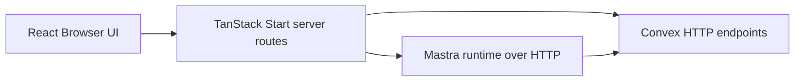

# Mastra HTTP Integration Playbook

## 1. Goal
Keep Mastra inside the same repository for development speed, but force it to behave like an external service by communicating with the React app over HTTP only.

This preserves the production shape now:

- the TanStack Start app owns the browser-facing surface
- the app server owns the HTTP gateway to Mastra
- Mastra runs as a separate Node process
- Mastra talks to platform data over HTTP
- provider keys stay inside the Mastra runtime only

## 2. Generic Repo Shape

```text
product-repo/
  src/                    # TanStack Start app
  docs/                   # Product and architecture docs
  mastra-runtime/         # Separate Mastra package and process
```

Recommended integration points:

- `src/routes/api/ai/chat.ts`
  Browser-safe server route that forwards chat requests to Mastra over HTTP.
- `mastra-runtime/src/mastra/agents/`
  Mastra agent definitions.
- `mastra-runtime/src/mastra/tools/`
  Mastra tools that fetch application context over HTTP.
- `src/lib/server/`
  App-side HTTP helpers and gateway code.

## 3. Required Runtime Boundary



Rules:

- The browser must not call Mastra directly.
- React client components must not import from `mastra-runtime/`.
- The app must call Mastra through `src/routes/api/*` handlers.
- Mastra must not mutate claim workflow state directly.
- Any authoritative claim action must still go through Convex-owned use cases.

## 4. Why This Shape Is Preferred

- It matches the planned hosted topology without splitting the repo too early.
- It keeps provider keys and agent internals out of the browser app.
- It lets the React app swap or version agent endpoints without coupling UI code to Mastra internals.
- It keeps Convex as workflow truth while Mastra stays advisory.
- It makes later extraction into a separately deployed Mastra service low-risk.

## 5. Environment Split

Root app `.env.local`:

```bash
MASTRA_SERVER_URL=http://localhost:4111
APP_BACKEND_URL=https://your-backend.example.com
```

Mastra runtime `mastra-runtime/.env`:

```bash
GOOGLE_API_KEY=your-provider-key
OPENROUTER_API_KEY=your-provider-key
GROQ_API_KEY=your-provider-key
OLLAMA_BASE_URL=http://127.0.0.1:11434
APP_BACKEND_URL=https://your-backend.example.com
```

Operational rule:

- `MASTRA_SERVER_URL` belongs to the app process.
- Provider keys belong only to `mastra-runtime/.env`.
- The backend base URL belongs in the Mastra runtime because Mastra reaches application context over HTTP.
- Do not duplicate provider secrets into the root app env.

## 6. Standard Request Flow

### Agent chat flow
1. The browser sends chat input to the app.
2. The app posts to `src/routes/api/ai/chat.ts`.
3. That route forwards the request to:
   `POST ${MASTRA_SERVER_URL}/api/agents/<agent-id>/stream`
4. Mastra streams the response back to the route.
5. The route converts the SSE stream into plain text for the AI SDK UI.

### App context lookup flow
1. The Mastra agent decides it needs product context.
2. A Mastra tool calls a backend HTTP endpoint.
3. The backend returns structured JSON.
4. Mastra uses that response to produce advisory output.

## 7. Local Development Commands

From the repository root:

Install:

```powershell
npm install
npm --prefix mastra-runtime install
```

Run the Mastra runtime:

```powershell
npm run mastra:dev
```

Run the app:

```powershell
npm run dev
```

Optional Convex dev loop:

```powershell
npx convex dev
```

Current local URLs:

- Mastra Studio and API: `http://localhost:4111`
- App URL: the URL printed by `npm run dev`

## 8. Implementation Rules For New AI Features

When adding a new Mastra-backed capability:

1. Add or update an app server route under `src/routes/api/`.
2. Keep the browser talking only to that route.
3. Have the route call Mastra through `MASTRA_SERVER_URL`.
4. Keep the request and response contract explicit and JSON-shaped where possible.
5. Let Mastra call Convex or Windmill through HTTP adapters, not direct in-process imports.
6. Persist any authoritative workflow outcome in Convex, not in Mastra memory.

Recommended responsibility split:

- React: rendering, AI SDK state, form input, stream display
- TanStack Start server routes: HTTP gateway, request shaping, future auth/session checks
- Mastra: prompts, tools, reasoning, streaming responses
- backend system of record: workflow truth, queues, state, audit events
- automation layer: OCR, parsing, or long-running jobs if used

## 9. Anti-Patterns To Avoid

- Importing `mastra-runtime` modules into `src/`.
- Calling `http://localhost:4111` directly from browser code.
- Storing provider API keys in the root app env.
- Letting Mastra write claim decisions directly as if it owns workflow state.
- Coupling UI rendering to raw provider payloads instead of the app route contract.
- Mixing demo-only mock claim context into the Mastra tool path once live platform data is available.

## 10. Production Mapping

This local setup should map directly to hosted deployment:

- React app deploys as the user-facing app
- Mastra deploys as a separate service
- the backend remains the system of record
- the automation layer remains the async processing layer when used

Only the base URLs should change. The transport shape should not.

## 11. Quick Verification Checklist

- `npm run mastra:dev` starts successfully.
- `npm run dev` starts successfully.
- Root app env contains `MASTRA_SERVER_URL`.
- `mastra-runtime/.env` contains the provider key and backend base URL.
- Chat requests reach the app route first, not Mastra directly from the browser.
- Mastra tool calls resolve application context from the backend over HTTP.

## 12. Decision Summary

A product can keep Mastra in-repo for now, but should treat it as a separate HTTP service at all times. That is the simplest setup that still preserves the intended production architecture.

## 13. Current Repo Example

This repository currently applies the playbook like this:

- `src/routes/api/ai/chat.ts` proxies chat requests to Mastra over HTTP using `MASTRA_SERVER_URL`.
- `mastra-runtime/src/mastra/agents/claims-triage-agent.ts` defines the current claims triage agent.
- `mastra-runtime/src/mastra/tools/lookup-claim-context-tool.ts` fetches claim context from Convex over HTTP using `CONVEX_SITE_URL`.
- `src/lib/server/convex-proxy.ts` contains app-side HTTP helpers for Convex-backed routes.

That is a concrete implementation of the generic boundary described above, not a special-case architecture.
